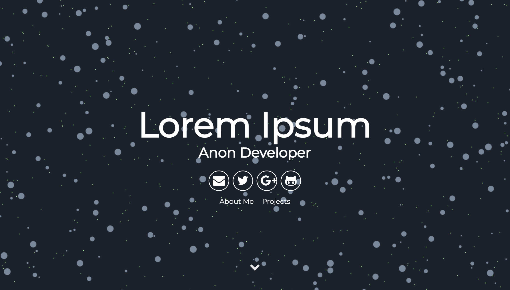

# An evolution simulator (written in Rust) mod for particle-zola

Particle-zola is a port for Zola of the Particle Jekyll theme. Check out the repo at https://github.com/svavs/particle-zola.

The main change in the theme consists in a different background logic.



Each ball has a size and an aggression level, and when/if manages to eat enough algae or other bacters it reproduces, creating
offsprings with slight changes in parameters.

And voilà, we have evolution! Check out the [Bacter](https://github.com/thelazyone/Bacter/) repo for more info.

The code for Bacter is entirely written in Rust and compiled with wasm-pack. I tried to add as little JS as possible to make it work on Zola.

This is a simple and minimalist template for Zola designed for developers that want to show of their portfolio.

## Installation and Usage

Refer to [particle-zola](https://github.com/svavs/particle-zola) for anything not strictly related to Bacter.
[Bacter](https://github.com/thelazyone/Bacter/) itself is going to be provided as binary for the time being. 
In the future it will instead part of the theme building process.

Just call `zola serve` to run it locally.

## Content Structure

This theme supports dynamic projects and blog posts through markdown files. Here's the folder structure:

```
content/
├── projects/           # Dynamic projects for homepage
│   ├── _index.md      # Projects section index
│   ├── project1.md    # Individual project files
│   └── project2.md
├── blog/              # Blog posts
│   ├── _index.md      # Blog section index
│   └── post-name/     # Individual blog posts
│       └── index.md
└── about.md           # About page
```

### Projects

Projects are displayed dynamically on the homepage. First, create a `content/projects/_index.md` file:

```markdown
+++
title = "Projects"
description = "A collection of my projects"
sort_by = "weight"
+++

This section showcases my various projects and creations.
```

Then create individual project files in `content/projects/` with the following format:

```markdown
+++
title = "Project Name"
weight = 1

[extra]
description = "Brief description of your project that will be displayed on the homepage."
image = "img/project-image.jpg"
link = "https://github.com/username/project"
+++

## Project Details

Your project content goes here. This will be displayed if someone visits the individual project page.

### Features
- Feature 1
- Feature 2
```

### Blog Posts

Create blog posts in `content/blog/post-name/index.md`:

```markdown
+++
title = "Your Blog Post Title"
date = 2024-01-15
description = "A brief description of your blog post"

[taxonomies]
tags = ["tag1", "tag2"]

[extra]
preview_image = "preview.jpg"
excerpt = "Custom excerpt text that appears in the blog listing instead of auto-generated text."
+++

# Your Blog Post Content

Write your blog post content here using markdown.

## Sections

You can use all standard markdown features.
```

**Blog Post Features:**
- `preview_image`: Image file in the same folder as your blog post (appears in blog listing)
- `excerpt`: Custom preview text for the blog listing (optional - falls back to auto-generated excerpt)

### Configuration

Make sure your `config.toml` includes:

```toml
base_url = "https://yourdomain.com"
theme = "bacter-particle-zola"

[extra]
username = "Your Name"
user_description = "Your description"
user_title = "Your Title"
```

### Quick Start

1. Create the projects section: `content/projects/_index.md`
2. Add project files: `content/projects/project-name.md`
3. Add images to: `static/img/`
4. Run: `zola serve`

The `weight` field in projects controls the display order (lower numbers appear first).

## Issues

For any problem or suggestion regarding Bacter, please file a [GitHub Issue](https://github.com/thelazyone/Bacter/issues/new) on the Bacter repo.

## License

Just like the project this is derived from, this theme is free and open source software, distributed under the The MIT License. So feel free to use this Jekyll theme anyway you want.

## Credits

- [Silvano Sallese](https://github.com/svavs/particle-zola)
- [Nathan Randecker](https://github.com/nrandecker/particle)
- [Willian Justen](https://github.com/willianjusten/will-jekyll-template)
- [Vincent Garreau](https://github.com/VincentGarreau/particles.js/)
