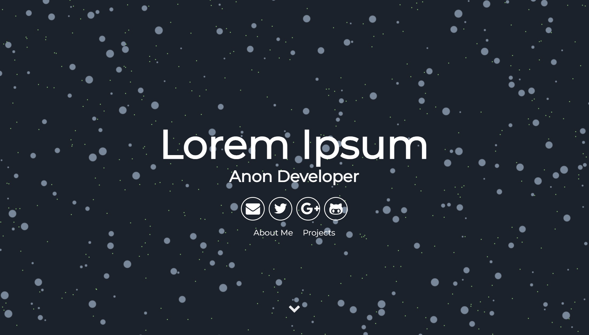

# An evolution simulator (written in Rust) mod for particle-zola

Particle-zola is a port for Zola of the Particle Jekyll theme. Check out the repo at https://github.com/svavs/particle-zola.

The only change in the theme consists in a different background logic.

zo

Each ball has a size and an aggression level, and when/if manages to eat enough algae or other bacters it reproduces, creating
offsprings with slight changes in parameters.

And voilà, we have evolution! Check out the [Bacter](https://github.com/thelazyone/Bacter/) repo for more info.

The code for Bacter is entirely written in Rust and compiled with wasm-pack. I tried to add as little JS as possible to make it work on Zola.

This is a simple and minimalist template for Zola designed for developers that want to show of their portfolio.

## Installation and Usage

Refer to [particle-zola](https://github.com/svavs/particle-zola) for anything not strictly related to Bacter.
[Bacter](https://github.com/thelazyone/Bacter/) itself is going to be provided as binary for the time being. 
In the future it will instead part of the theme building process.

## Issues

For any problem or suggestion regarding Bacter, please file a [GitHub Issue](https://github.com/thelazyone/Bacter/issues/new) on the Bacter repo.

## License

Just like the project this is derived from, this theme is free and open source software, distributed under the The MIT License. So feel free to use this Jekyll theme anyway you want.

## Credits

- [Silvano Sallese](https://github.com/svavs/particle-zola)
- [Nathan Randecker](https://github.com/nrandecker/particle)
- [Willian Justen](https://github.com/willianjusten/will-jekyll-template)
- [Vincent Garreau](https://github.com/VincentGarreau/particles.js/)
